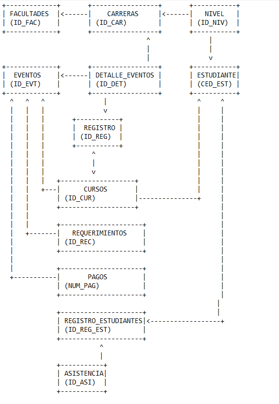

EVENTOS

ID_EVT | NOM_EVT | FEC_EVT | LUG_EVT | TIP_EVT | MOD_EVT |

DETALLE_EVENTOS

ID_DET | ID_EVT | CAR_EVT | ASI_EVT |

REGISTRO

ID_REG | ID_DET | ID_NIV |

RESGISTRO_ESTUDIANTES

ID_REG_EST | CED_EST | ID_REG | VAL_REG_EST | FEC_REG_EST

CURSOS

ID_CUR | NOM_CUR | NOT_CUR | HOR_CUR | ARE_CUR | CAT_CUR | ID_EVT |

ESTUDIANTES

CED_EST | NOM_EST | APE_EST | TEL_EST | NOT_EST | ASI_EST |ID_CUR | ID_NIV |

NIVEL

ID_NIV | NOM_NIV | ORG_CUR_NIV | ID_CAR |

CARRERAS

ID_CAR | NOM_CAR | ID_FAC |

FACULTADES

ID_FAC | NOM_FAC | UBI_PRE_FAC |

REQUERIMIENTOS

ID_REC | ID_EVT | DES_REC | 

PAGOS

NUM_PAG | ID_EVT | ID_REG_EST |

ASISTENCIA

ID_ASI | ID_REG_EST | FEC_ASI |

PORFAVOR REVISAR COMPAÑEROS Y AÑADIR COMO PUNTOS DE ANALISIS EN ESTE MISMO .md

Ver si la tabla Facultad es necearia, ya que la pagina se centra en la FISEI.
Agregar mision y visión a las carreras, y a la facultad si la tabla se queda. 
En lugar de una tabla estudiantes se podria hacer una tabla usuarios con roles administrador y estudiante

