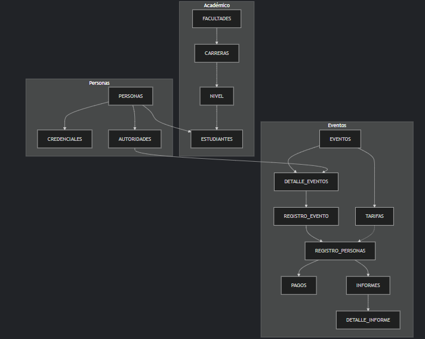

CONNECT
CREATE USER EVENTOS_UTA IDENTIFIED BY EVENTOS123;
GRANT CONNECT, RESOURCE, UNLIMITED TABLESPACE TO EVENTOS;
DISCONNECT

EVENTOS

ID_EVT | NOM_EVT | FEC_EVT | LUG_EVT | TIP_EVT | MOD_EVT | -> |ID DEL EVENTO| NOMBRE DEL EVENTO| FECHA DEL EVENTO | LUGAR DEL EVENTO | TIPO DE VENTO | MODALIDAD DEL EVENTO |

CREATE TABLE EVENTOS(
    ID_EVT VARCHAR(10) PRIMARY KEY,
    NOM_EVT VARCHAR(25) NOT NULL,
    FEC_EVT DATE NOT NULL,
    LUG_EVT VARCHAR (25) NOT NULL,
    TIP_EVT VARCHAR(10) CHECK(TIP_EVT IN ('GRATUITO','DE PAGO')),
    MOD_EVT VARCHAR(10) CHECK(MOD_EVT IN ('PUBLICO','PRIVADO'))
);

TARIFAS_EVENTO

ID_EVT | TIP_PAR | VAL_EVT | -> |ID DEL EVENTO| TIPO DE PARTICIPANTE | VALOR DEL EVENTO |

CREATE TABLE TARIFAS_EVENTO(
    ID_EVT NOT NULL REFERENCES EVENTOS(ID_EVT),
    TIP_PAR VARCHAR(10) CHECK(TIP_PAR IN ('ESTUDIANTE','PERSONA')),
    VAL_EVT NUMBER NOT NULL
);

DETALLE_EVENTOS

ID_DET | ID_EVT  | CED_AUT | CUP_DET | NOT_DET | HOR_DET | ARE_DET | CAT_DET -> |ID DEL DETALLE |ID DEL EVENTO | ID AUTORIDAD A CARGO | CUPOS DEL EVENTO |NOTA REQUERIDA PARA APROBAR | HORAS DEL EVENTO | AREA DEL EVENTO | CATEGORIA DEL EVENTO 

CREATE TABLE DETALLE_EVENTOS(
    ID_DET VARCHAR(10) PRIMARY KEY,
    ID_EVT NOT NULL REFERENCES EVENTOS(ID_EVT),
    CED_AUT NOT NULL REFERENCES PERSONAS(CED_PER),
    CUP_DET NUMBER(3) NOT NULL,
    NOT_DET NUMBER(4,2) NOT NULL,
    HOR_DET NUMBER(4,2) NOT NULL,
    ARE_DET VARCHAR(40) CHECK (ARE_CUR IN ('SALUD Y SERVICIOS SOCIALES','CIENCIAS NATURALES Y MATEMATICAS','TECNOLOGIA E INGENIERIA',
    'ARTES Y HUMANIDADES','CIENCIAS SOCIALES,COMUNICACION Y DERECHO','ADMINISTRACION Y NEGOCIOS','EDUCACION','SERVICIOS GENERALES')),
    CAT_DET VARCHAR(20) CHECK(CAT_DET IN ('CURSO','CONGRESO','WEBINAR','CONFERENCIAS','SOCIALIZACIONES','TALLERES','SEMINARIOS','OTROS'))
);

REGISTRO_EVENTO

ID_REG_EVT | ID_DET | ID_NIV | -> |ID REGISTRO DE NIVEL|ID DEL DETALLE| ID NIVEL |

CREATE TABLE REGISTRO_EVENTO(
    ID_DET VARCHAR(10) PRIMARY KEY,
    ID_REG_EVT NOT NULL REFERENCES REGISTRO EVENTO(ID_REG),
    ID_NIV NOT NULL REFERENCES NIVELES(ID_NIV)
);

RESGISTRO_PERSONAS

NUM_REG_PER | CED_PER  |ID_REG_EVT | TIP_PAR | FEC_REG_PER  -> |NUMERO DE REGISTRO DE PERSONA| CEDULA DE LA PERSONA |ID DEL REGISTRO DEL EVENTO | TIPO DE PARTICIPANTE |  FECHA DEL REGISTRO DE LA PERSONA

CREATE TABLE REGISTRO_PERSONAS(
    NUM_REG_PER NUMBER PRIMARY KEY,
    CED_PER NOT NULL REFERENCES PERSONAS(CED_PER),
    ID_REG_EVT NOT NULL REFERENCES REGISTRO_EVENTO(ID_REG_EVT),
    TIP_PAR NOT NULL REFERENCES TARIFAS_EVENTO(TIP_PAR),
    FEC_REG_PER DATE NOT NULL
);

CREATE SEQUENCE NUM_REG
INCREMENT BY 1
START WITH 1
MAX VALUE 100000
NOCYCLE
NOCACHE;

PERSONAS

CED_PER | NOM_PER | APE_PER |TEL_PER | URL_CED_PER |  -> |CEDULA DE LA PERSONA| NOMBRE DE LA PERSONA | APELLIDO DE LA PERSONA | TELEFONO DE LA PERSONA |

CREATE TABLE PERSONAS(
    CED_PER VARCHAR(10) PRIMARY KEY,
    NOM_PER VARCHAR(20) NOT NULL,
    APE_PER VARCHAR(20) NOT NULL,
    TEL_PER NUMBER(10) NOT NULL
);

CREDENCIALES

CED_PER |COR_PER |CON_PER | -> | CORREO DE LA PERSONA | CONTRASEÑA DE LA PERSONA|

CREATE TABLE CREDENCIALES(
    CED_PER NOT NULL REFERENCES PERSONAS(CED_PER),
    COR_PER VARCHAR(50)NOT NULL,
    CON_PER VARCHAR(20) NOT NULL

);

ESTUDIANTES

ID_EST | CED_PER | ID_NIV | REC_ACA_EST  -> |ID DELESTUDIANTE| CEDULA DE LA PERSONA | ID DEL NIVEL

CREATE TABLE ESTUDIANTES(
    ID_EST VARCHAR(10) PRIMARY KEY,
    CED_EST NOT NULL REFERENCES PERSONAS(CED_PER),
    ID_NIV NOT NULL REFERENCES NIVEL(ID_NIV)

);

NIVEL

ID_NIV | NOM_NIV | ORG_CUR_NIV | ID_CAR | -> |ID DEL NIVEL | NOMBRE DEL NIVEL | ORGANIZACION CURRICULAR DEL NIVEL | ID DE LA CARRERA

CREATE TABLES NIVEL(
    ID_NIV VARCHAR(10) PRIMARY KEY,
    NOM_NIV VARCHAR(10) CHECK(NOM_NIV IN ('PRIMERO','SEGUNDO','TERCERO','CUARTO','QUINTO','SEXTO','SEPTIMO','OCTAVO','NOVENO','DECIMO'))
    ORG_CUR_NIV VARCHAR (10) CHECK (ORG_CUR_NIV IN ('BASICA','PROFESIONAL')),
    ID_CAR NOT NULL REFERENCES CARRERAS(ID_CAR)
);

CARRERAS

ID_CAR | NOM_CAR | ID_FAC | -> |ID DE LA CARRERA| NOMBRE DE LA CARRERA| ID DE LA FACULTAD|

CREATE TABLE CARRERAS(
    ID_CAR VARCHAR(10) PRIMARY KEY,
    NOM_CAR VARCHAR(25) NOT NULL,
    ID_FAC NOT NULL REFERENCES FACULTADES(ID_FAC)
);

FACULTADES

ID_FAC | NOM_FAC | UBI_PRE_FAC | MIS_FAC | VIC_FAC -> |ID DE LA FACULTAD| NOMBRE DE LA FACULTAD| UBICACION DEL PREDIO DE LA FACULTAD| MISION DE LA FACULTAD | VISION DE LA FACULTAD |

CREATE TABLE FACULTADES(
    ID_FAC VARCHAR(10) PRIMARY KEY,
    NOM_FAC VARCHAR(30) NOT NULL,
    UBI_PRE_FAC VARCHAR(15) CHECK (UBI_PRE_FAC IN ('HUACHI','INGAURCO','QUEROCHACA')),
    MIS_FAC VARCHAR(255) NOT NULL,
    VIC_FAC VARCHAR (255) NOT NULL
);

AUTORIDADES

ID_AUT | CED_PER | DIR_AUT | CAR_AUT | ID_FAC | -> |ID DE LA AUTORIDAD| CEDULA DE LA PERSONA | DIRECCION DE LA AUTORIDAD| CARGO DE LA AUTORIDAD | ID DE LA FACULTAD| 

CREATE TABLE AUTORIDADES (
    ID_AUT VARCHAR(10) PRIMARY KEY,
    CED_PER NOT NULL REFERENCES PERSONAS(CED_PER),
    DIR_AUT VARCHAR(30) NOT NULL,
    CAR_AUT VARCHAR(20) CHECK (CAR_AUT IN ('DECANO','SUBDECANO','SECRETARIA','DOCENTE','RESPONSABLE CTT','COORDINADOR')),
    ID_FAC NOT NULL REFERENCES FACULTADES(ID_FAC)
);
 
REQUERIMIENTOS

ID_REC | ID_EVT | DES_REC |  ULR_REQ -> |ID DEL REQUERIMIENTO |ID DEL EVENTO | DESCRIPCION DEL REQUERIMIENTO | URL DEL REQUERIMIENTO SOLICITADO

CREATE TABLE REQUERIMIENTOS(
    ID_REC VARCHAR(10) PRIMARY KEY,
    ID_EVT NOT NULL REFERENCES EVENTOS(ID_EVT),
    DES_REC VARCHAR(255) NOT NULL,
    URL_REQ VARCHAR (50) NOT NULL
);

PAGOS

NUM_PAG | ID_EVT | NUM_REG_PER | VAL_PAG -> | NUMERO DE PAGO | ID DEL EVENTO | NUMERO DE REGISTRO DE LA PERSONA | VALOR DEL PAGO

CREATE TABLE PAGOS(
    NUM_PAG NUMBER PRIMARY KEY,
    ID_EVT NOT NULL REFERENCES EVENTOS(ID_EVT),
    NUM_REG_PER NOT NULL REFERENCES REGISTRO_PERSONAS(NUM_REG_PER),
    VAL_PAG NUMBER(5,2) NOT NULL
);

CREATE SEQUENCE NUM_PAG
INCREMENT BY 1
START WITH 1
MAX VALUE 100000
NOCICLE
NOCACHE;

INFORMES

NUM_INF | NUM_REG_PER | -> | NUMERO DE INFORME | NUMERO DE REGISTRO DE PERSONA |

CREATE TABLE INFORMES(
    NUM_IFN NUMBER PRIMARY KEY,
    NUM_REG_PER NOT NULL REFERENCES REGISTRO_PERSONAS(NUM_REG_PER)
);

CREATE SEQUENCE NUM_INF
INCREMENT BY 1
START WITH 1
MAX VALUE 100000
NOCICLE
NOCACHE;

DETALLE_INFORME

NUM_DET_INF |NUM_INF |REG_ASI |NOT_DET -> NUMERO DE DETALLE INFORME |NUMERO DE INFORME | REGISTRO DE ASISTENCIA DEL INFORME | NOTA DEL INFORME |

CREATE TABLE DETALLE_INFORME(
    NUM_DET_INF NUMBER PRIMARY KEY,
    NUM_INF NOT NULL REFERENCES INFORMES (NUM_INF),
    REG_ASI DATE ,
    NOT_DET NUMBER(5,2) NOT NULL
);

Tabla de relaciones

Tabla de dependencias

Flujo de eventos

